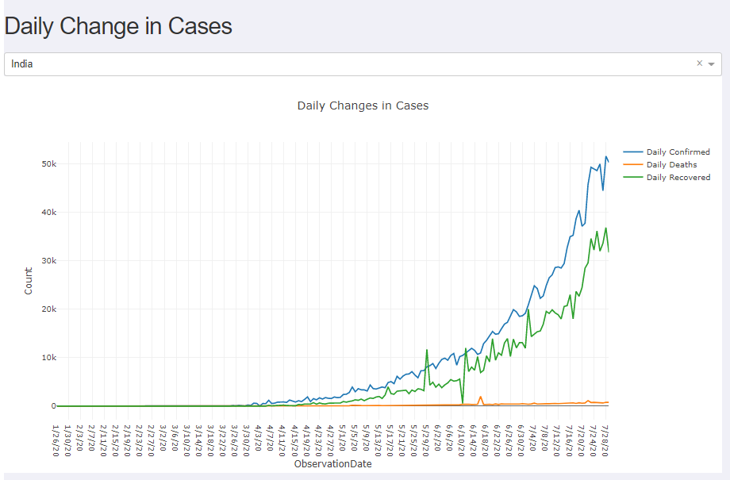
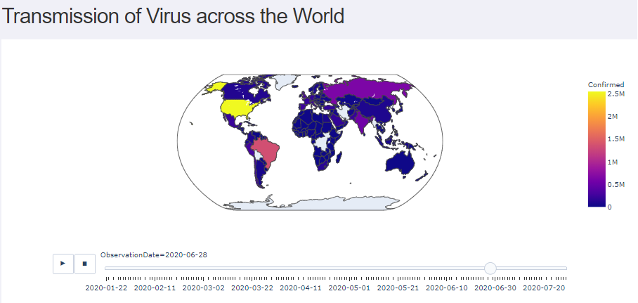
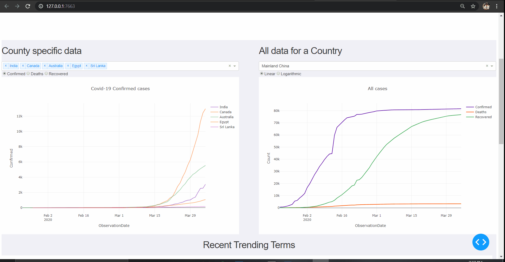
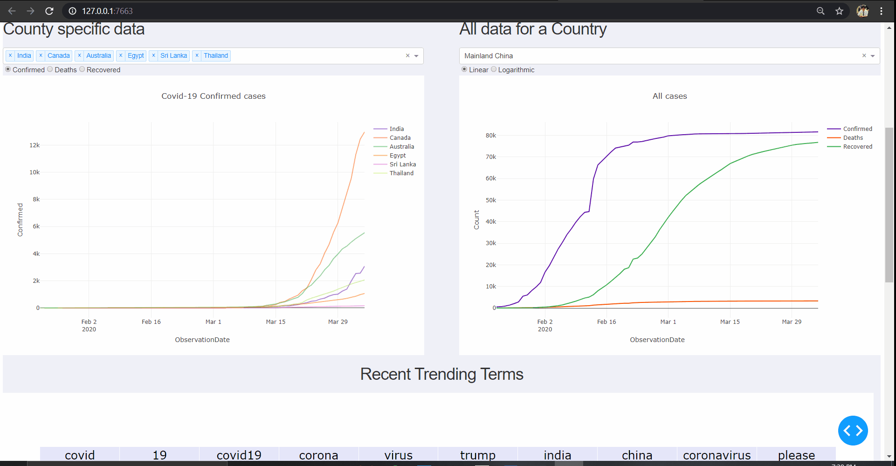
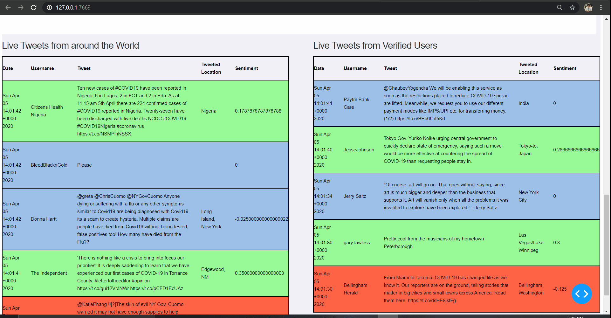

# Covid19_Analysis

### Pre-requisites:
1. Create Twitter API tokens 
    * Create an account on `https://developer.twitter.com`
    * Create an application with a unique name
    * To access the Twitter API, you will need 4 things from the your Twitter App page. These keys are located in your Twitter app settings in the Keys and Access Tokens tab.
        * consumer key
        * consumer secret key
        * access token key
        * access token secret key
    * Create a directory called `creds` and a file `credentials.py` inside it. Save these credentials as Variables in it
    * Do not share these with anyone else because these values are specific to your app.

2. Docker for Windows/Linux
   * Link Here -> https://docs.docker.com/docker-for-windows/install/
   * 4GB RAM
   * Windows Subsystem for Linux (for Windows users)

3. MongoDB, MongoDB (Compass)
   * Link Here -> https://www.mongodb.com/try/download/community
   * Setup process available on the site
   
4. Redis, redis-scheduler
   For Windows: 
      * Need Windows Subsystem for Linux (WSL) - Ubuntu (`https://ubuntu.com/wsl`)
      * Inside the Ubuntu Terminal, `sudo service redis-server start`
      * To test, `redis-cli` -> `ping` -> Expected Response: `PONG`
      * Redis is working
   
   For Linux: 
      * apt install redis
      * setup docs available online for Linux

### Steps to Run:
1. Clone the repository `https://github.com/eeshsingh123/Covid19_Analysis.git`
2. Setup Docker & docker-compose in the system
3. Run the command, `docker-compose up --build -d` (-d for daemon build)

### Steps to Run (*Without Docker*): 
1. Terminal 1 : python3 -m app.flask_main (`to run flask app`)
2. Terminal 2 : python3 -m app.twitter_main (`to run twitter app`)
3. Terminal 3: python3 -m rq_queue data_updater (`run the redis queue, to update the reports based on scheduler call` )
4. Terminal 4: rqscheduler -v (`Scheduler which runs periodically and collects users, hashtags data from twitter and updates graph data from covid api`)

### Repository Contents:
1. `/app/flask_main.py`: Flask app which handles the API calls and interacts with the JS Front-end code using Jinja2 template

2. `/app/twitter_main.py`: Runs 24/7 and collects data from the Twitter Stream leveraging the tweepy stream api, stores data
   into mongoDB and generates trending on a Runtime
3. `/workers`: Consists of the API and Twitter data Aggregation, Preprocessing and Modelling logic before sending it to
the Front-end via Flask app

4. `/concepts`: Consists of various Jupyter notebooks where each logic has been tried and tested before integration

5. `/static & /templates`: Has all the JavaScript, CSS & Templates file used by Flask for UI integration

6. `/tools` : Contains Helper functions to perform tasks needed

### NEW FLASK BASED APP:
HOME PAGE: 
   
  

STATE DISTRIBUTION:

VACCINATION AVAILABILITY:

### OLD CORE DASH APP :
**New Feature**

2. Graphs

3. Live Twitter Feed (Color coded sentiment wise)

