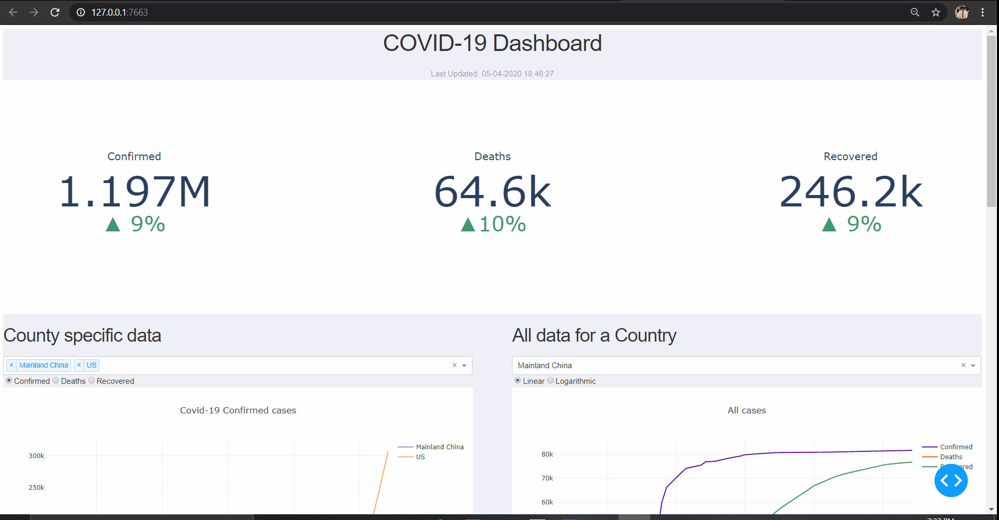
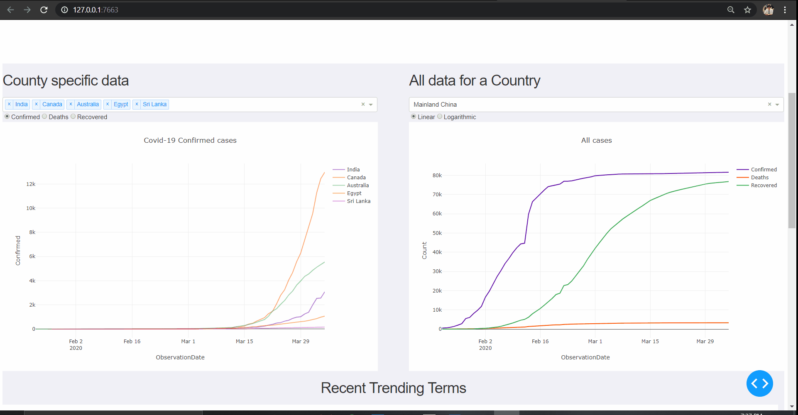

# Covid19_Analysis

### Pre-requisites:
1. Create Twitter API tokens 
    * Create an account on `https://developer.twitter.com`
    * Create an application with a unique name
    * To access the Twitter API, you will need 4 things from the your Twitter App page. These keys are located in your Twitter app settings in the Keys and Access Tokens tab.
        * consumer key
        * consumer secret key
        * access token key
        * access token secret key
    * Create a directory called `creds` and a file `credentials.py` inside it. Save these credentials as Variables in it
    * Do not share these with anyone else because these values are specific to your app.
2. Create an account in Kaggle
3. Follow these steps to generate a Kaggle API token: https://github.com/Kaggle/kaggle-api
4. Save the kaggle.json key to `C:\Users\<username>\.kaggle` if on Windows OS

5. Create a directory `twitter_db` in the project root folder where our Database will be saved, then Create a directory `kaggle_data in it` i.e.  `\twitter_db\kaggle_data`

### Steps to Run:
1. Clone the repository `https://github.com/eeshsingh123/Covid19_Analysis.git`
2. Install `requirements.txt` using `pip install -r requirements.txt`
3. *Run* twitter_data.py `python -m app.twitter_data`
4. *Run* dash_main.py `python -m app.dash_main`

### Repository Contents:
1. `twitter_data.py`: This app runs in the background and it streams twitter data using the tweepy 
module, stores it into the `Sqlite3` Database for processing and also saves trends.

2. `dash_main.py`: The front-end of the application. It contains the entire app layout and Dash application layouts,
 logic for graphs, interfaces with the database etc. Much more contents will be added in the future.
 
3. `misc\sql_helper.py`: A Generic SQL helper Class which has methods for various SQL operations

4. `misc\update_daily_data.py` : A worker file which extracts the data of COVID-19 using the Kaggle API
it runs daily based on predefined constraints

5. `misc\dbclean_daily.py`:  Cleans Database everyday to keep the size in check. Runs daily based on predefined constraints

6. `\tools` : Contains Helper functions to perform tasks needed

### App:
1. Full App

2. Graphs

3. Live Twitter Feed

